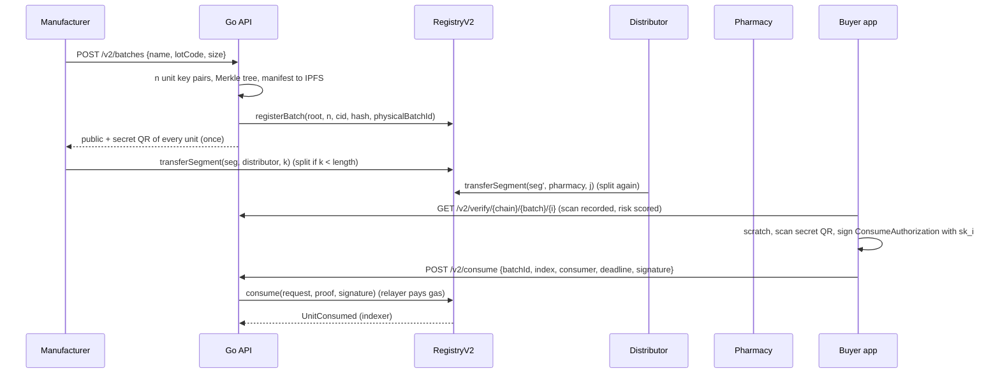

# Protocol v2: Merkle-batched, signature-based unit authentication

Protocol v2 (`SupplementRegistryV2`, ABI and API `2.0.0`) tracks individual
units of a supplement lot. It keeps the four-layer architecture
(smart contract, IPFS, Go indexer/API, Android) and the three-party custody
chain (manufacturer, distributor, pharmacy). Only the way units are
registered, moved and consumed changes. v1 (`SupplementRegistry`) stays
deployed next to it and is the baseline in the evaluation (scheme S0).

| Goal | Mechanism |
| --- | --- |
| Registration cost independent of lot size | One Merkle root per batch |
| Custody that matches how stock really moves | Contiguous index ranges (segments) that split on transfer |
| A unit can be "used up" exactly once, and a refilled box is detectable | One-time unit key, consumption bitmap |
| The consumer needs no wallet and no ETH | EIP-712 authorization relayed by the operator |
| Copying the printed code is not enough | Two-layer label; the secret never goes on-chain |
| Copies of the public code are visible | Scan events scored by an explainable risk model |
| Defective lots can be pulled | Recall of a batch or of one segment |

## 1. Objects

**Batch.** `size` units (1 to `MAX_BATCH_SIZE` = 2^20; the API caps it at
`MAX_BATCH_UNITS`, default 5000) committed by one Merkle root. On-chain the
contract stores `merkleRoot`, `size`, `manufacturer`, `consumedCount`,
`invalid`, `metadataCid`, `metadataHash` and `physicalBatchId`. The last one is
`keccak256("lot:" + lowercase(manufacturer) + ":" + lotCode)`, and it is
unique, so a lot cannot be registered twice.

**Unit.** Index `i` in `[0, size)`. It has a fresh secp256k1 key pair
`(sk_i, pk_i)`, and `unitKey_i` is the Ethereum address of `pk_i`.

**Segment.** A half-open range `[start, end)` of one batch, held by one owner,
with status `Created → Transferred → AtPointOfSale`, or `Invalid` after a
recall. When a batch is registered, the manufacturer holds segment
`[0, size)`. The segments of a batch always partition `[0, size)`; the contract
tests check this with a fast-check property.

**Consumption bitmap.** `BitMaps.BitMap` per batch, so each unit costs 1 bit.
256 units share one storage word.

## 2. Cryptographic construction

### Merkle commitment

Leaves use the OpenZeppelin `StandardMerkleTree` encoding:

```text
leaf_i = keccak256( keccak256( abi.encode(uint32 i, address unitKey_i) ) )
```

The tree hashes sorted pairs, as `@openzeppelin/merkle-tree` does. A proof for
one unit has about `ceil(log2 n)` siblings: 7 for n = 100, 13 for n = 10 000.
`internal/merkle` (Go), `UnitMerkleVerifier` (Android) and the contract are
checked against the same reference vectors
(`packages/abis/test-vectors/supplement-registry-v2.json`, produced by
`npm run vectors`).

### Public manifest

At registration the API pins a JSON manifest to IPFS. `metadataCid` and
`metadataHash` go on-chain:

```json
{
  "schemaVersion": 2,
  "protocol": "supplement-registry/2",
  "name": "...", "lotCode": "...", "manufacturer": "0x...",
  "expiresAt": "2027-12-31", "size": 100,
  "merkleRoot": "0x...",
  "leafEncoding": "keccak256(bytes.concat(keccak256(abi.encode(uint32 index, address unitKey)))), sorted-pair tree",
  "unitKeys": ["0x...", "..."]
}
```

The manifest contains only public keys (addresses). Anyone can rebuild the
tree and compare it with the on-chain root. The API also uses the manifest to
restore unit rows if its database loses them.

### Consume authorization (EIP-712)

```text
domain      = { name: "SupplementRegistry", version: "2", chainId, verifyingContract: RegistryV2 }
primaryType = ConsumeAuthorization(uint256 batchId, uint32 index, address consumer, uint256 deadline)
signature   = sign(sk_i, hashTypedDataV4(...))
```

- The signer must recover to `unitKey_i`. It is not the transaction sender:
  any relayer can submit the transaction.
- `consumer` is inside the signed data. A copied transaction from the
  mempool can only consume the unit for the same consumer, so front-running
  gains nothing.
- The domain binds the chain and the contract, so a signature cannot be
  replayed on another deployment. The bitmap rejects a second use on the same
  deployment.
- `GET /v2/chains` publishes the domain, the types and the primary type, so
  clients do not hard-code them.

## 3. Labels

| Layer | Content | Who reads it |
| --- | --- | --- |
| Public QR (printed in the open) | `{PUBLIC_VERIFY_BASE_URL}/{chainId}/{batchId}/{index}`, e.g. `https://supplementtracker.aut.ir/u/31337/7/3` | Anyone; opens the Android app via an App Link (`/u/`) |
| Secret QR (under a scratch-off layer) | `satk2:{chainId}:{batchId}:{index}:{sk_i hex}` | The buyer, once, to record use |

The private keys are returned once, in the `POST /v2/batches` response
(`keysRevealOnce: true`). The API never stores them. `POST /v2/labels/render`
accepts them back only to draw the PDF. Each key is checked against the
committed `unitKey`, and the key is discarded after rendering.

## 4. Lifecycle



### Register

`registerBatch(root, size, cid, metadataHash, physicalBatchId)` needs
`MANUFACTURER_ROLE`. It writes a fixed number of storage slots, so its gas does
not depend on `size`.

### Transfer and split

`transferSegment(segmentId, to, count)` moves the first `count` units:

- If `count` equals the segment length, the owner and status change and the
  segment id stays the same.
- Otherwise a new segment `[start, start + count)` goes to `to`, and the
  sender keeps `[start + count, end)` under the old id.

The status can only advance one step, and only to a holder of the matching
role:

| From | To holder of | New status |
| --- | --- | --- |
| `Created` | `DISTRIBUTOR_ROLE` | `Transferred` |
| `Transferred` | `PHARMACY_ROLE` | `AtPointOfSale` |

Anything else reverts with `InvalidTransfer`. This includes skipping the
distributor, sending backwards, or a transfer from a pharmacy. The API exposes
this as `POST /v2/segments/:id/transfer {toAddress, count?}`. The API signs
with the owner's managed key, but the contract enforces every rule.

### Consume

`consume(request, proof, signature)` accepts the transaction from any sender,
in this order:

1. `block.timestamp <= deadline`, and `consumer != 0`.
2. The batch exists and is not recalled. The named segment belongs to the
   batch, has status `AtPointOfSale` and contains `index`.
3. The unit is not consumed yet (bitmap).
4. `MerkleProof.verifyCalldata(proof, root, leaf(index, unitKey))`.
5. The ECDSA signature over the authorization recovers to `unitKey`.
6. The contract sets the bit, increments `consumedCount` and emits
   `UnitConsumed(batchId, index, segmentId, unitKey, consumer, submitter)`.

`POST /v2/consume` runs the same checks before it spends gas: chain id,
deadline, signature recovery, unit not consumed, Merkle membership of the
recovered key, custody. It then picks the proof and segment itself. The client
sends only `(batchId, index, consumer, deadline, signature)`.

Error codes:

| Situation | HTTP status |
| --- | --- |
| Malformed input, wrong key, key not in the tree, expired deadline | 400 |
| Already consumed (refill attempt) | 409 |
| Not yet at a pharmacy | 409 |
| Recalled | 409 |

### Recall

`invalidateBatch(batchId)` and `invalidateSegment(segmentId)` can be called by
the batch's manufacturer or by the admin. The API endpoint is
`POST /v2/batches/:id/recall {segmentId?, reason?}`. A recall takes precedence
over every other state, and recalled units cannot be consumed. `pause()` stops
all writes.

## 5. Verification

The public verdict combines on-chain state with the scan history:

| Verdict | Condition |
| --- | --- |
| `Recalled` | batch or holding segment invalidated |
| `Consumed` | consumption bit set |
| `Authentic` | at a pharmacy (`AtPointOfSale`), not consumed |
| `InTransit` | genuine, still with the manufacturer or distributor |
| `Suspicious` | would be `Authentic`/`InTransit`, but the clone risk is high |

`GET /v2/verify/...` returns the verdict together with:

- the custodian's public profile (name and region);
- the risk score, level and reasons;
- `evidence`: the Merkle root, the leaf, the proof, the unit key and the
  registration tx.

The Android app does not trust that verdict blindly. `VerifyUnitUseCase` does
three checks of its own:

1. It recomputes the leaf and folds the proof (`UnitMerkleVerifier`).
2. It reads `getBatch(batchId).merkleRoot` and `isConsumed(batchId, index)`
   directly from the chain (`Web3jChainAnchorReader`).
3. It flags a contradiction if the proof fails or the API's root differs from
   the on-chain root. A consumed flag that disagrees with the chain is reported
   in the evidence card. It is not treated as a contradiction, because the
   API's projection can lag a block behind.

A contradicted `Authentic` or `InTransit` is shown as `Suspicious`, and the
consume button is hidden. If the RPC is unreachable, the checks show as
skipped instead of passing.

## 6. Clone detection

A counterfeiter can photocopy a public QR, but not the hidden key, so copies
appear as scan patterns. Every public scan stores:

- a keyed device hash: HMAC-SHA256 under `SCAN_HASH_SALT` of the
  `X-Device-Id` header, or of the IP and User-Agent when there is no header,
  truncated to 128 bits. The raw identifiers are never stored, and the salt is
  mandatory in production;
- a coarse region slug (`X-Scan-Region`, one of the 31 provinces in the app);
- the verdict at scan time.

`internal/risk` turns the history into signals and rules:

| Rule (`code`) | Signal | Weight per excess unit |
| --- | --- | --- |
| `many_devices` | distinct devices before consumption above 3 | 0.25 |
| `scanned_after_consumption` | devices that first appear after consumption (the buyer re-scanning their own box does not count) | 0.45 |
| `foreign_region` | regions other than the custodian pharmacy's, when known | 0.30 |
| `region_spread` | more than 1 region, when the custodian's region is unknown | 0.30 |

Each rule gives `w = min(0.95, 1 - (1 - unit)^count)`. The rules are combined
with a noisy-OR, `score = 1 - prod(1 - w)`, capped at 0.999. The levels are
`medium` from 0.3 and `high` from 0.6. Reasons are returned as codes, so the
app localizes them. `GET /v2/scans/suspicious` lists units at or above a
threshold for the admin panel. The thresholds come from the simulation in
[`evaluation.md`](evaluation.md).

## 7. Indexing

The Go indexer reads `BatchRegistered`, `SegmentTransferred`, `UnitConsumed`,
`BatchInvalidated` and `SegmentInvalidated`:

- It starts at the contract's `deployBlock` (from `packages/abis/deployments.json`
  or `INDEXER_START_BLOCK`) and persists its cursor.
- Segment writes are ordered by `(block, logIndex)`, so the projection
  converges whatever order API writes and replays arrive in.
- The optional `subgraph/` indexes the same events into `Batch`, `Segment`,
  `SegmentTransfer`, `UnitConsumption` and `Recall`.

## 8. Relation to v1 and to the evaluated schemes

| Scheme | Registration | Consumption proof | Contract |
| --- | --- | --- | --- |
| S0 | one record per unit (v1), secret hash on-chain | reveal the secret to the contract | `SupplementRegistry` |
| S1 | one batch of size 1 per unit | unit-key signature, empty proof | `SupplementRegistryV2` |
| S2 | one batch of size n | unit-key signature plus Merkle proof | `SupplementRegistryV2` |

S1 is the special case of S2 with n = 1, so both are the same contract. The
costs are in [`evaluation.md`](evaluation.md).

## 9. Where things live

| Concern | Path |
| --- | --- |
| Contract | `contracts/contracts/SupplementRegistryV2.sol`, `contracts/contracts/domain/BatchTypes.sol` |
| Contract tests, gas bench, vectors | `contracts/test/`, `contracts/scripts/bench-gas.ts`, `contracts/scripts/export-vectors.ts` |
| Merkle, EIP-712, indexer | `backend/internal/merkle`, `backend/internal/chain` |
| Services (batch, segment, consume, verify, labels) | `backend/internal/protocol` |
| Risk model, simulator, load generator | `backend/internal/risk`, `backend/cmd/scansim`, `backend/cmd/loadgen` |
| End-to-end suite | `backend/e2e/protocol_v2_test.go` |
| Android client | `core:model` (`UnitCodes`), `core:blockchain` (`Eip712ConsumeSigner`, `UnitMerkleVerifier`, `ConsumerKeyStore`), `core:data` (`HttpProtocolRepository`) |
| Endpoints | [`backend/README.md`](../backend/README.md#protocol-v2-v2-supplementregistryv2) |
